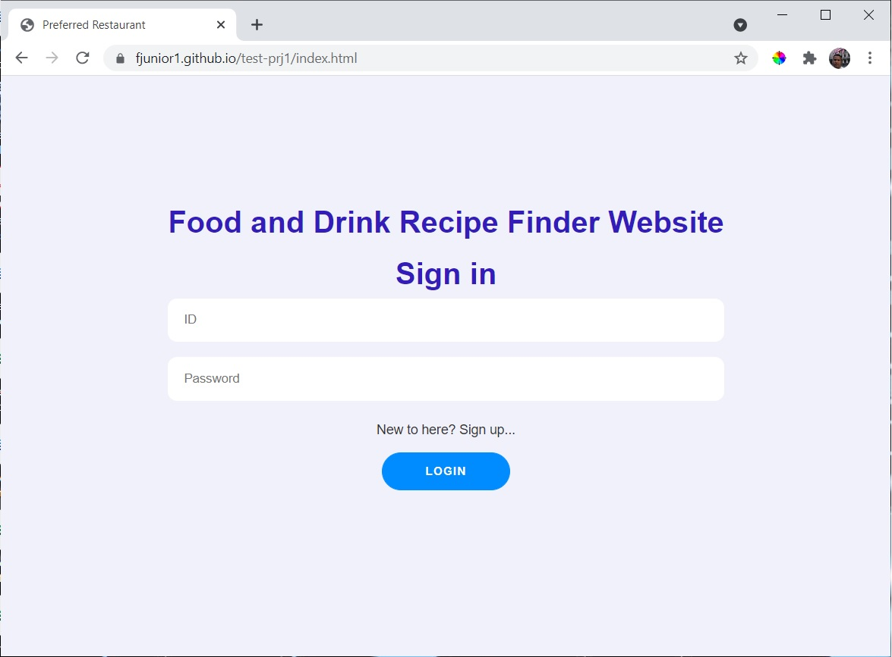
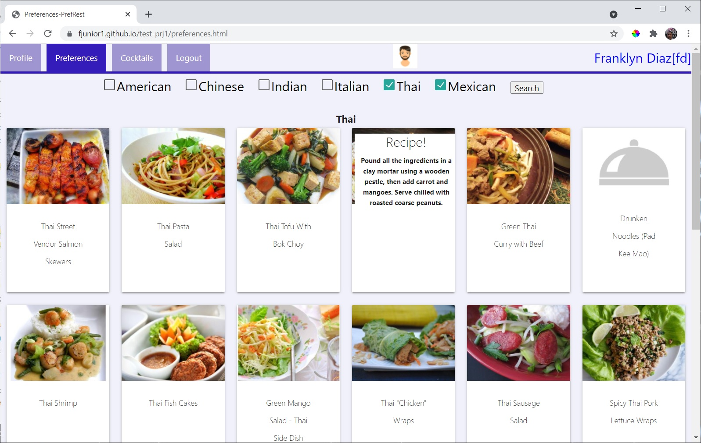
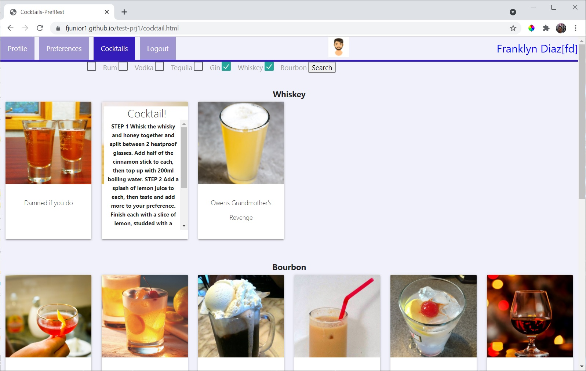

# Project - Food and Cocktail Recipes

Food and Drink Recipe Finder Website
Simple Recipe App created with Vanilla JS, HTML and CSS.

## Table of contents
- General Info  
- Technologies   
- Features  
- Future devlopement  
- Links  

## General Info
Food and Drink Recipe Finder Website is a application created to generate recipes and cocktail options for the everyday person. With a very simple user friendly interface users are able to simply access the application and select preferred recipes to prepare and consume. 

## Technologies
Project is created with
Vanilla JS
HTML
CSS
Local storage
Session storage

## Features
Search and find new recipes
Search and find new cocktails

## Future devlopement
In the future we would like to develope a favorites page to store recipes/cockatils for future reference. 

## Links
Deployed project - https://fjunior1.github.io/test-prj1/

## pictures
Docs folder containing pictures of the deployed site - https://github.com/fjunior1/test-prj1/tree/main/docs

  
  
  

